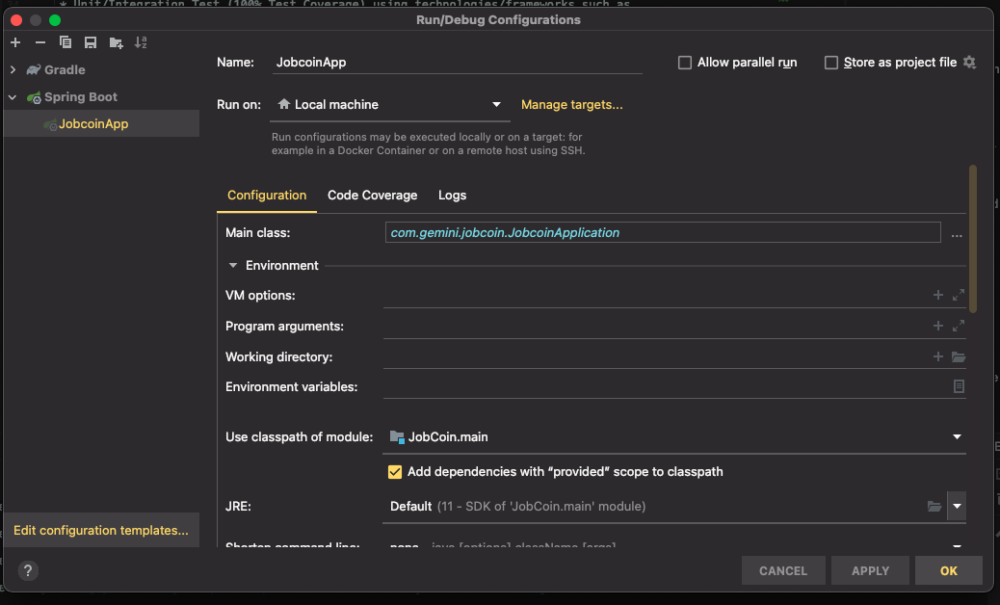

# Jobcoin Mixer

Check out my [Demo]()

## Developer Setup
### Prerequisites
1. Java 11
2. gradle
4. ```git clone https://github.com/shaunaweiss/JobCoin.git```

### Intellij
1. Import the project to Intellij as an appropriate gradle or maven project
2. Set main class and Run: <br>
   ```com/gemini/jobcoin/JobcoinApplication.kt```
3. Running locally using Intellij 


### Gradle
* Compile and run unit tests: ```./gradlew build```
* Style check: ```./gradlew ktlintformat```

## Intended Flow for Coin Mixers
1. You provide a list of new, unused addresses that you own to the mixer
2. The mixer provides you with a new deposit address that it owns;
3. You transfer your bitcoins to that address;
4. The mixer will detect your transfer by watching or polling the P2P Bitco in network;
5. The mixer will transfer your bitcoin from the deposit address into a big "house account" along with all the other bitcoin currently being mixed; and
6. Then, over some time the mixer will use the house account to dole out your bitcoin in smaller discrete increments to the withdrawal addresses that you provided, possibly after deducting a fee.

## Some assumptions I made about Jobcoin
* The mixer's deposit address that we create is unique, and we do not have to worry about duplications.
* The addresses provided to us by the user DO exist and are owned by that user.
* Only one transaction is being sent to the address provided by the mixer. (If more than one transaction is made, that money is lost to the house address. :( )

## Future Todos
If time was something I had more of, here are a couple of things I would've included/changed...
* UML Diagram
* Unit/Integration Test (100% Test Coverage) using technologies/frameworks such as 
    * Junit5
    * [MockK](https://mockk.io/)
    * [Spring-Boot-Starter-Test](https://docs.spring.io/spring-boot/docs/1.0.x-SNAPSHOT/reference/html/boot-features-testing.html)
* Utilized a Database / Separate Persistence layer. (Redis could be a nice touch?)
* Swagger Docs
* More validation handling around the responses from the Jobcoin API (instead of throwing Runtime Exceptions)...
* Added Unit tests specifically around null property values throughout, to ensure null safety. 

### Future Feature Adds 
* Add a random delay to the tasks responsible for sending the "mixed" transactions to enhance the anonymity of the mixing process.
* Additional Retry Mechanisms- If calls to the external jobcoin API Fail, enqueue the tasks in question to retry at a later cron interval.
  * Further, if for some reason one of the "outgoingAddresses" does not exist or the transaction fails to go through, implement a solution that enables the coins to be sent to one of the other provided addresses, and if all else fails, back to the original sender address.

_Additional Implementation ideas are available in the comments of many classes._
  
## Resources
* [Jobcoin API](https://jobcoin.gemini.com/tremble/api/)